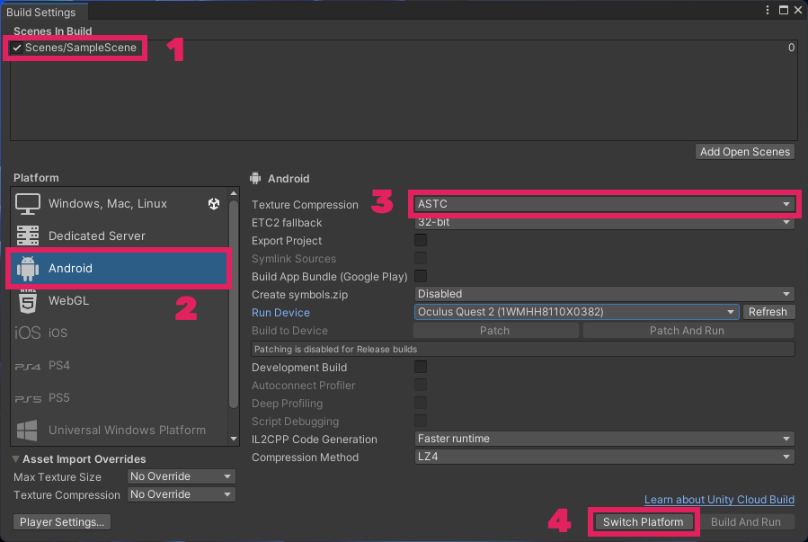

# Meta Quest 3 Unity Template

This Unity project serves as a starting point for Meta Quest 2 Projects. It was craeted with Unity version: 2020.3.10

I have optimized the Project Settings for Quest 2 development. I have essentially followed the same steps as those described in my tutorial video here:

[How to Optimize Unity Project Settings for Oculus/Meta Quest 2](https://youtu.be/2KUliN2R2pQ)

  
The only noteable difference is that this project makes use of the Vulkan Graphics API, rather than OpenGLES 3.

### Setup

Once you have opened the project in Unity, there are a few things you need to do manually, for the project to be ready to work with.
  
* In the Project Assets panel, go to the Scenes folder and open the **SampleScene**.

* Now go to the top menu and select File -> **Build Settings...**
  
The Build Settings window will appear...

  
In Build Settings...
1. Make sure that **SampleScene** is added to the **Scenes In Build** list.
2. Select **Android** from the **Platform** list.
3. Change **Texture Compression** to **ASTC**.
4. Click the **Switch Platform** Button.

Once the project's assets have re-imported you should be ready to go!

## Disclaimer
This project is provided "as is" without warranty of any kind. Use at your own risk. The author is not responsible for any damage or data loss resulting from the use of this package. Compatibility and performance may vary depending on your system configuration.

  

